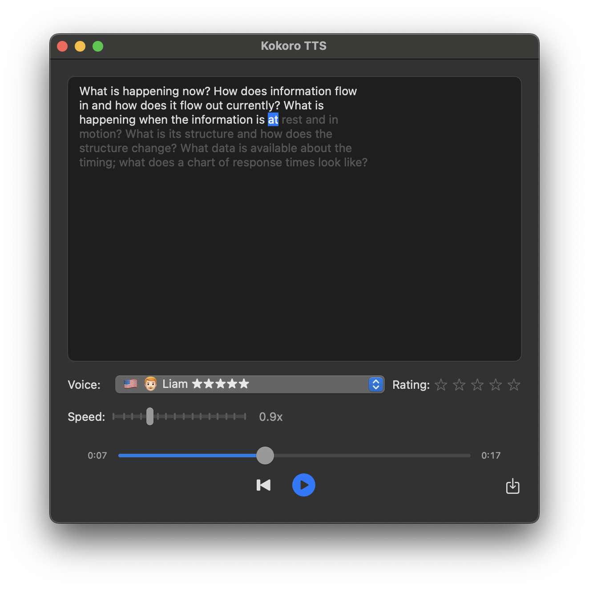

# KokoroTTS

Small macOS application for the Kokoro TTS (Text-to-Speech) model, allowing high-quality offline TTS.
Integrates as a macOS service to speak selected text quickly.



## Usage

Select any text in any application and press **⌘⇧P** (Command+Shift+P) to speak it.

To change the keyboard shortcut, go to **System Settings → Keyboard → Keyboard Shortcuts → Services → Text → Speak with Kokoro**.

Alternatively, paste text directly into the app's text field and click Speak. The generated audio can also be saved to a file.

## Supported Platforms

- macOS 15.0+

## Installation

### Option 1: Download Release

Download the latest DMG from the [Releases](https://github.com/kjyv/KokoroTTS/releases) page.

Since the app is not signed, macOS will block it by default. To open it:
1. Right-click the app and select "Open"
2. Click "Open" in the dialog that appears

Or remove the quarantine attribute via Terminal:
```bash
xattr -cr /Applications/KokoroTTS.app
```

### Option 2: Build from Source

⚠️ **Important**: This repository uses Git LFS to store the large neural network model file (`kokoro-v1_0.safetensors`, ~315MB). You must have Git LFS installed and configured before cloning:

```bash
# Using Homebrew (macOS)
brew install git-lfs
git lfs install
```

Otherwise cloning and running the application is done as any other app:

1. **Clone the repository** (Git LFS will automatically download the model file):
   ```bash
   git clone https://github.com/kjyv/KokoroTTS.git
   cd KokoroTTS
   ```

2. **Verify model file**: Ensure the model file was downloaded correctly:
   ```bash
   ls -la Resources/kokoro-v1_0.safetensors
   # Should show a file of approximately 315MB
   ```

3. **Open in Xcode**:
   ```bash
   open KokoroTTS.xcodeproj
   ```

4. **Build and run** the project in Xcode

## Features

- **High-Quality TTS**: Leverages the Kokoro neural TTS model for natural-sounding speech synthesis
- **Multiple voices**: Supports different voice options
- **Faster than real-time generation**: Fast audio generation with performance metrics 
- **MLX integration**: Optimized for Apple Silicon using the MLX machine learning framework

## Dependencies

This project uses Swift Package Manager with the following dependencies:

- [Kokoro iOS](https://github.com/mlalma/kokoro-ios): Kokoro TTS engine
- [MLX](https://github.com/ml-explore/mlx-swift): Apple's MLX machine learning framework
- [MisakiSwift](https://github.com/mlalma/MisakiSwift): Misaki G2P library
- [MLXUtilsLibrary](https://github.com/mlalma/MLXUtilsLibrary): For reading the .npz file for voice styles

## License

This project is licensed under the Apache 2.0 License - see the [LICENSE](LICENSE) file for details.
